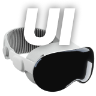
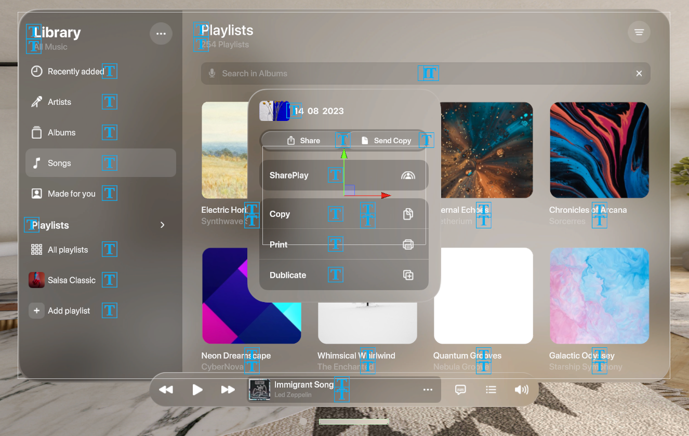
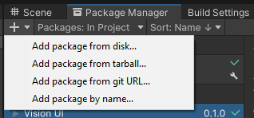
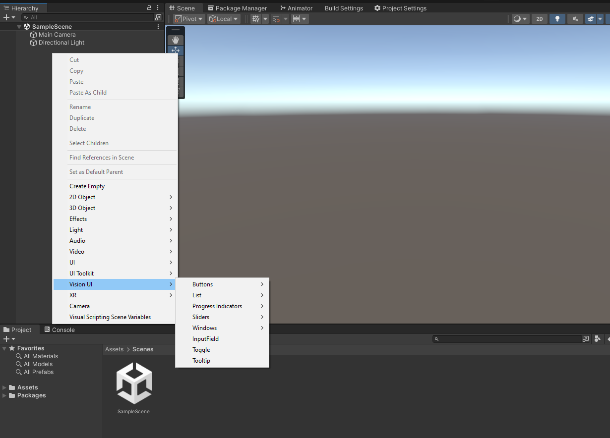

<p align="center">
  <a href="https://u3d.as/39rT">
    
  </a>
</p>
<h4 align="center">
  <a href="https://jet.style/">JetStyle</a> |
  <a href="https://jetxr.style/">JetXR</a> |
  <a href="https://u3d.as/39rT">Asset Store</a>
</h4>

### Apple Vision Pro UI Kit © 2023 JetStyle

## Introduction
We created this Unity UI kit so that developers can prototype their future Apple Vision Pro app interfaces. We strongly believe that if we want to make our prototypes user-friendly, we have to test them on real users in VR. Since all of us don’t have access to Apple Vision Pro headsets yet, we still can test the interfaces on the VR equipment we have today, e.g. Meta Quest and Meta Quest Pro. 

Just download this UI kit (it’s based on the official Apple Figma kit) to build your Vision Pro apps. 

This Unity UI kit will give you an opportunity to: 

+ Create a functional app prototype
+ See how it behaves in VR 
+ Test it on real users 
+ Experiment and improve it, so that it’s perfect by the time Vision Pro is out.

<a href="https://www.youtube.com/watch?v=D28MGn96O3c">Watch our video on YouTube</a>
<p align="center">
  <a href="https://www.youtube.com/watch?v=D28MGn96O3c">
    
  </a>
</p>

## Installation
1. You can install it with **Package Manager** > **+** > **Add package from git URL...**
```
https://github.com/jetstyle/Apple-Vision-Pro-UI-Kit.git
```


2. You can also install with git url by adding this entry in your **manifest.json**
```
"com.jetxr.visionui": "https://github.com/jetstyle/Apple-Vision-Pro-UI-Kit.git"
```
3. You can also download it from the [Asset Store](https://u3d.as/39rT)

4. Prepared demo project for Meta Quest is avaliable [here](https://github.com/jetstyle/Apple-Vision-Pro-UI-Kit-Demo)

## How to use it?
Our package provides a collection of UI elements that can be added to a scene using the GameObject context menu.



## UI Elements List

<p align="center">
  
</p>

1. Buttons
    + Symbol
    + Text
    + Text + Symbol
    + Text Rounded Rect
2. List
    + List Element
3. Progress Indicators
    + Throbber
    + Progress Bar
4. Sliders
    + Small Slider
    + Regular Slider
5. Windows
    + Window
    + Window + Tabbar
    + Window + Toolbar
    + Alert
    + Add-ons
        * Toolbar
        * Tabbar
        * Sidebar
6. Input Field
7. Toggle
8. Tooltip
