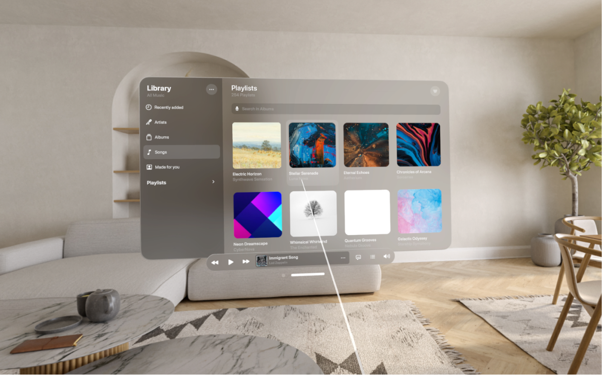
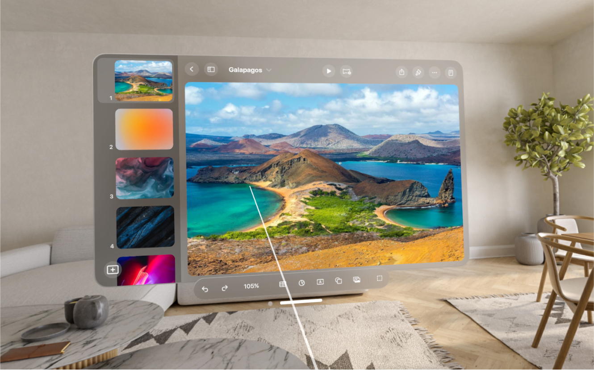
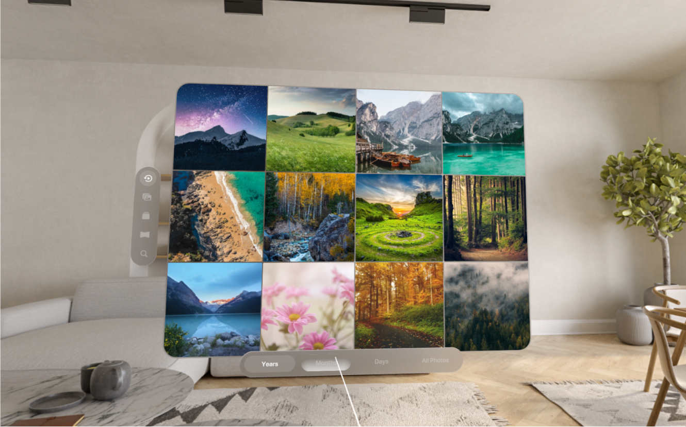
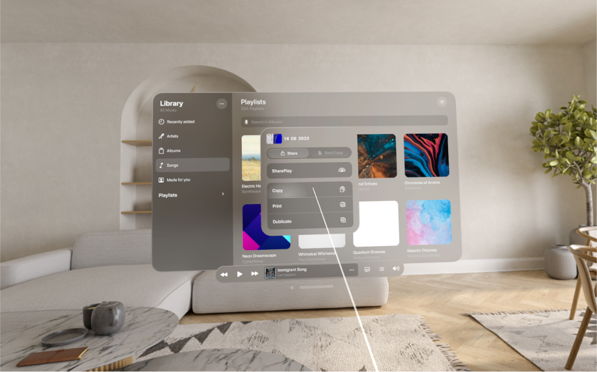
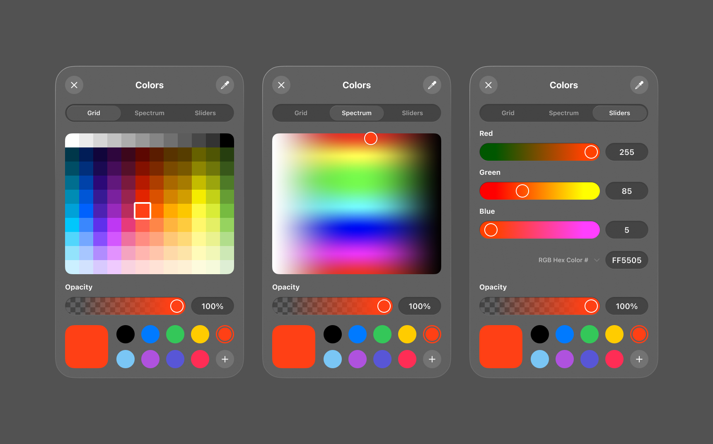
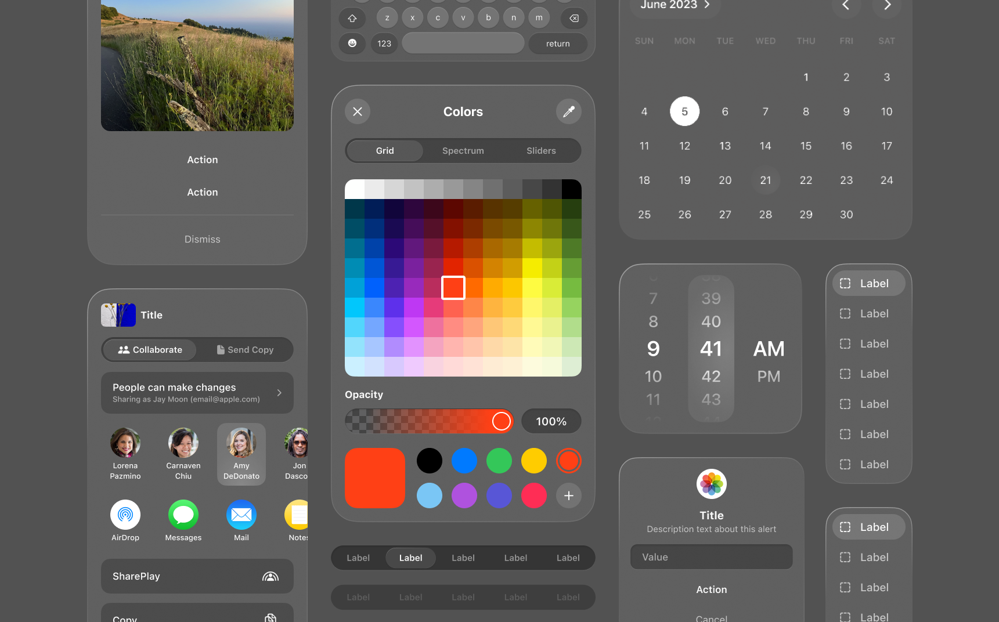
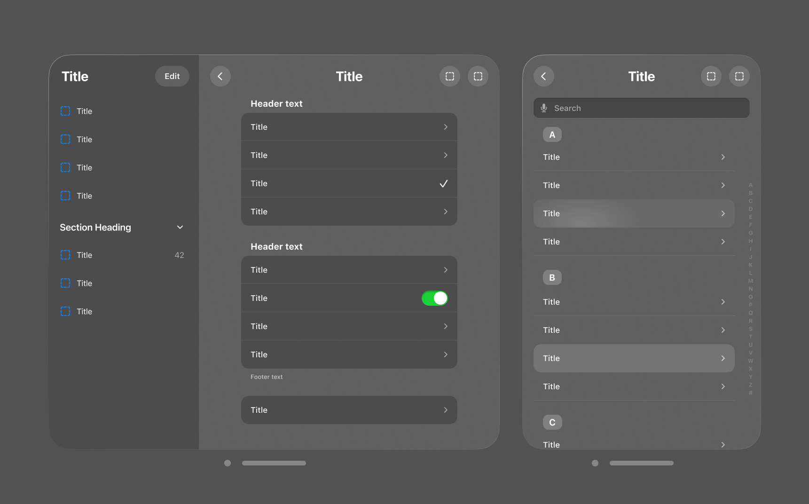

<p align="center">
  <a href="https://u3d.as/39rT">
    
  </a>
</p>
<h4 align="center">
  <a href="https://jet.style/">JetStyle</a> |
  <a href="https://jetxr.style/">JetXR</a> |
  <a href="https://discord.gg/YYprp42G">Discord</a>
</h4>

### Apple Vision Pro UI Kit © 2023 JetStyle

## Introduction
We created this Unity UI kit so that developers can prototype their future Apple Vision Pro app interfaces. We strongly believe that if we want to make our prototypes user-friendly, we have to test them on real users in VR. Since all of us don’t have access to Apple Vision Pro headsets yet, we still can test the interfaces on the VR equipment we have today, e.g. Meta Quest and Meta Quest Pro. 

Just download this UI kit (it’s based on the official Apple Figma kit) to build your Vision Pro apps. 

This Unity UI kit will give you an opportunity to: 

+ Create a functional app prototype
+ See how it behaves in spatial environment (aka "VR")
+ Test it on real users
+ Experiment and improve it, so that it’s perfect by the time Vision Pro is out.

<a href="https://www.youtube.com/watch?v=D28MGn96O3c">Watch our video on YouTube</a>
<p align="center">
  <a href="https://www.youtube.com/watch?v=D28MGn96O3c">
    
  </a>
</p>

## System Requirements
Unity **2021.3.30f1** or later versions.

## Installation
1. You can install it with **Package Manager** > **+** > **Add package from git URL...**
```
https://github.com/jetstyle/Apple-Vision-Pro-UI-Kit.git
```


2. You can also install with git url by adding this entry in your **manifest.json**
```
"com.jetxr.visionui": "https://github.com/jetstyle/Apple-Vision-Pro-UI-Kit.git"
```

3. You can also download it from the [Asset Store](https://assetstore.unity.com/packages/tools/gui/ui-kit-for-vision-pro-os-265406)

4. Prepared demo project for Meta Quest is avaliable [here](https://github.com/jetstyle/Apple-Vision-Pro-UI-Kit-Demo)

## How to use it?
Our package provides a collection of UI elements that can be added to a scene using the GameObject context menu.


A small gif with the process of working with our package:
<p align="center">
  
</p>

## Showcases
Demonstration of interfaces based on our package (captured on Meta Quest 2 with our panorama):
<p align="center">
  
  
</p>

<p align="center">
  
  
</p>

## UI Elements List

<p align="center">
  
</p>

<p align="center">
  
  
</p>

<p align="center">
  
</p>

1. Buttons (in different sizes and in two versions: with and without platter)
    + Symbol
    + Text
    + Text + Symbol
    + Text Rounded Rect
2. List
    + Completed List
    + List Element (+ No Platter version)
3. Progress Indicators
    + Throbber
    + Progress Bar
4. Sliders
    + Mini Slider
    + Small Slider
    + Regular Slider
    + Large Slider
5. Windows
    + Window
    + Window + Tabbar
    + Window + Toolbar
    + Alert
    + Windows Stacker
    + Add-ons
        * Toolbar
        * Tabbar
        * Sidebar
        * Window Controls
        * Window Resizer
6. Input Field
7. Toggle
8. Tooltip
9. Segmented Control
10. Volume